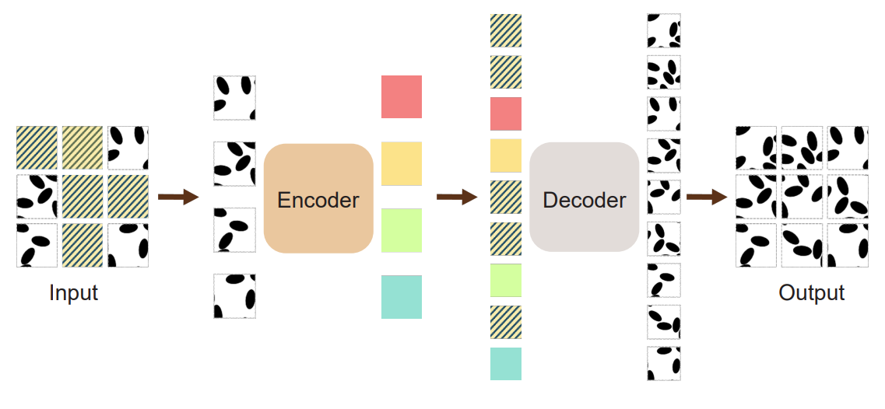
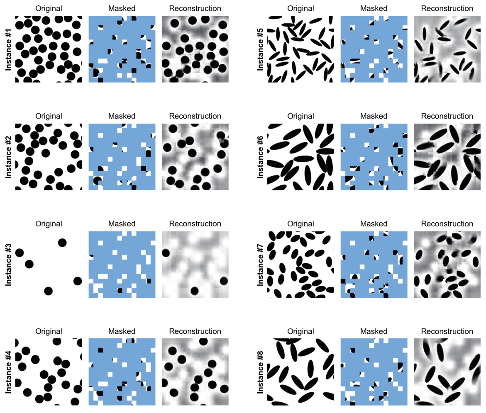

# MMAE: Foundation Model for Composite Materials and Microstructural Analysis

## Overview

This repository contains the code and instructions for training and evaluating the Masked Material Autoencoder (MMAE) as described in the paper "Foundation Model for Composite Materials Using Masked Autoencoders". The MMAE is used for self-supervised pre-training on composite material microstructures and then fine-tuned or used in linear probing for downstream tasks such as predicting homogenized stiffness components.


## Architecture

Below is the architecture of the MMAE model:



## Reconstruction Example

Here is an example of the reconstructed microstructure from the MMAE model:



## Necessary Packages and Versions

To run the code, you'll need the following packages:

```plaintext
torch==2.0.1
torchvision==0.15.2
torchaudio==2.0.2
timm==0.4.5
scikit-learn==1.3.0
scipy==1.10.1
numpy==1.24.3
pandas==2.0.2
matplotlib==3.7.1
joblib==1.2.0
fsspec==2023.6.0
```

**Note:** Ensure compatibility between package versions, Python version (e.g., Python 3.10), and CUDA version if using GPU acceleration.

## Preparation

1. **Install Required Packages**


2. **Download the Datasets**

   Download the datasets for pre-training and transfer learning from Zenodo:

   - [Datasets for MMAE Pre-Training and Transfer Learning](https://doi.org/10.5281/zenodo.14062123)


## Stage 1: MMAE Pre-Training

To pre-train the MMAE, run:

```bash
python main_pretrain.py \
    --data_path /path/to/inclusion_train_100k \
    --batch_size 100 \
    --epochs 400 \
    --mask_ratio 0.85 \
    --output_dir /path/to/output_dir \
    --log_dir /path/to/log_dir \
    --num_workers 4
```

**Parameters:**

- `--data_path`: Path to the pre-training dataset (`inclusion_train_100k`).
- `--batch_size`: Batch size for training (e.g., 100).
- `--epochs`: Number of training epochs (e.g., 400).
- `--mask_ratio`: Masking ratio for the MAE (e.g., 0.85).
- `--output_dir`: Directory to save training outputs and checkpoints.
- `--log_dir`: Directory for logging training progress.
- `--num_workers`: Number of worker threads for data loading.

**Notes:**

- You can overwrite configurations by passing arguments with the corresponding key names.
- All stdout messages and including checkpoints are stored in the specified `--output_dir`.

## Stage 2: Transfer Learning

### Linear Probing


To perform linear probing, run:

```bash
python main_linprobe.py \
    --data_path /path/to/downstream_dataset \
    --finetune /path/to/pretrained_mmae/checkpoint-399.pth \
    --output_dir /path/to/output_dir \
    --log_dir /path/to/log_dir \
    --cls_token \
    --numDataset NUM_DATASET \
    --target_col_name TARGET_COLUMN
```

**Parameters:**

- `--data_path`: Path to the downstream dataset (e.g., `downstream_short_fiber/train`).
- `--finetune`: Path to the pre-trained MMAE checkpoint.
- `--output_dir`: Directory to save outputs and logs.
- `--log_dir`: Directory for logging.
- `--cls_token`: Use the [CLS] token for embedding.
- `--numDataset`: Number of data samples to use.
- `--target_col_name`: The target column name in the dataset (e.g., `C1111`, `C2222`, `C1212`).

**Example:**

```bash
python main_linprobe.py \
    --data_path ./downstream_short_fiber/train \
    --finetune ./output_dir/pretrained_mmae/checkpoint-399.pth \
    --output_dir ./output_dir/linear_probing \
    --log_dir ./logs/linear_probing \
    --cls_token \
    --numDataset 5000 \
    --target_col_name C1111
```

### End-to-End Fine-Tuning

To perform end-to-end fine-tuning, use the same script `main_linprobe.py` without freezing the encoder layers.

Run:

```bash
python main_linprobe.py \
    --data_path /path/to/downstream_dataset \
    --finetune /path/to/pretrained_mmae/checkpoint-399.pth \
    --output_dir /path/to/output_dir \
    --log_dir /path/to/log_dir \
    --cls_token \
    --numDataset NUM_DATASET \
    --target_col_name TARGET_COLUMN
```

**Notes:**

- Ensure that the script is set up to allow gradient updates to all encoder layers for fine-tuning.
- Modify the script or configurations if necessary to perform end-to-end fine-tuning.

### Partial Fine-Tuning

For partial fine-tuning, use the script `main_finetune.py`.

Run:

```bash
python main_finetune.py \
    --data_path /path/to/downstream_dataset \
    --finetune /path/to/pretrained_mmae/checkpoint-399.pth \
    --output_dir /path/to/output_dir \
    --log_dir /path/to/log_dir \
    --cls_token \
    --partial_fine_tuning \
    --num_tail_blocks NUM_TAIL_BLOCKS \
    --numDataset NUM_DATASET \
    --num_workers 2 \
    --target_col_name TARGET_COLUMN
```

**Parameters:**

- `--partial_fine_tuning`: Indicates partial fine-tuning is enabled.
- `--num_tail_blocks`: Number of transformer blocks at the end of the encoder to fine-tune (e.g., 2).
- `--num_workers`: Number of worker threads for data loading.

**Example:**

```bash
python main_finetune.py \
    --data_path ./downstream_short_fiber/train \
    --finetune ./output_dir/pretrained_mmae/checkpoint-399.pth \
    --output_dir ./output_dir/partial_finetune \
    --log_dir ./logs/partial_finetune \
    --cls_token \
    --partial_fine_tuning \
    --num_tail_blocks 2 \
    --numDataset 5000 \
    --num_workers 2 \
    --target_col_name C1111
```
